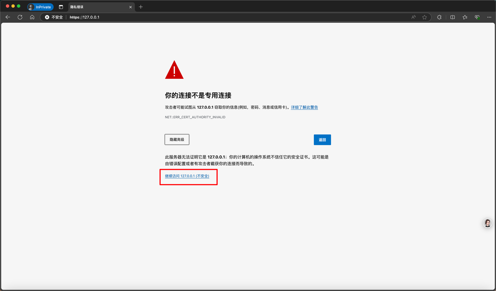
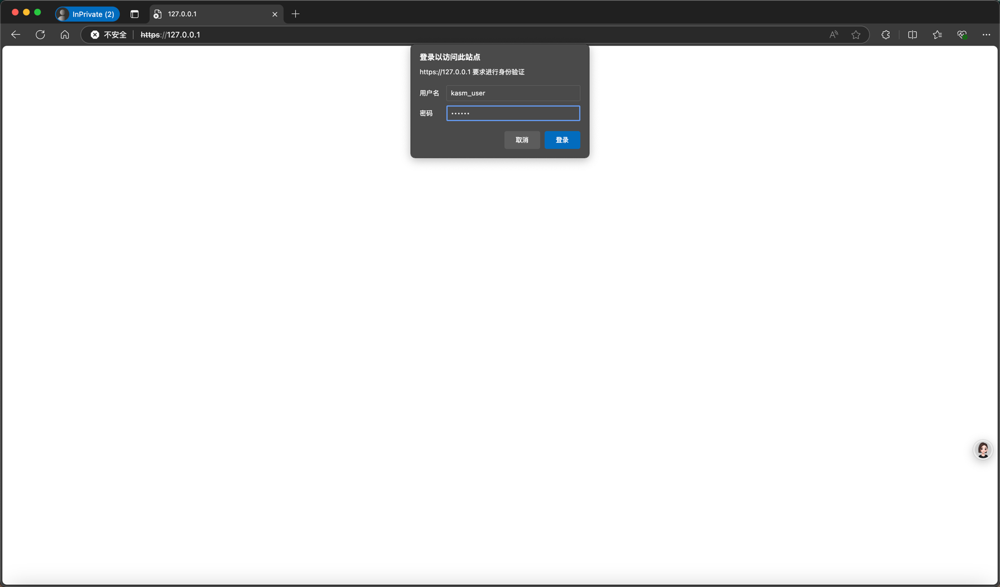
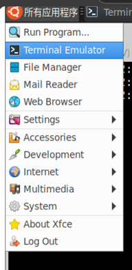
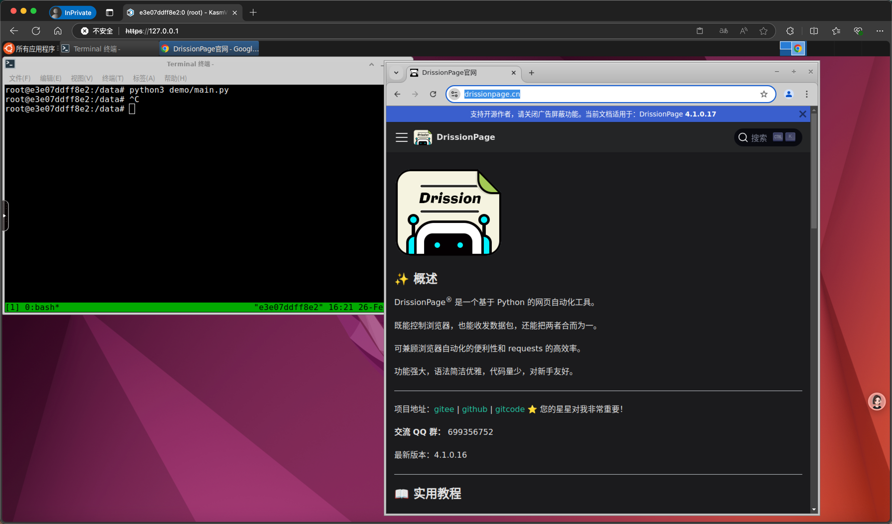

# kasm-rpa-desktop

基于 Kasmweb 的 Docker RPA 开发环境，提供完整的 Ubuntu 桌面界面。预装 Chrome、DrissionPage、VSCode 等工具，专为 Web 自动化和 RPA 开发打造。

# 背景

在我们当前的项目中，面临着一个有趣的挑战：如何通过自动化手段高效地查询网站信息并截图结果。这个需求不仅要求我们截取整个网页，还需要能够灵活地截取系统中的特定窗口。

在企业环境中，服务器大多运行在无图形界面的 CentOS 或 Ubuntu 系统上。随着技术的发展，项目部署逐渐转向 Kubernetes 集群，传统的虚拟机环境变得越来越少见。这种转变促使我们寻找新的解决方案，以便在无图形界面的环境中实现图形化的自动化操作。

因此，我们开发了这个基于 Kasmweb 的 Docker RPA 开发环境，旨在为开发者提供一个完整的 Ubuntu 桌面界面，预装了 Chrome、DrissionPage、VSCode 等工具，专为 Web 自动化和 RPA 开发而设计。

# 优点

- 基于docker虚拟化，方便部署，有界面。基于Kasmweb，提供完整的 Ubuntu 桌面界面。
- 预装 Chrome、DrissionPage、VSCode 等工具，方便开发，适合 Web 自动化和 RPA 开发
- 预装了python, DrissionPage, VSCode, Chrome

# 使用方法

## 1、运行容器

```
docker run -d \
    --name kasm-rpa-desktop \
    --shm-size=512m \
    -p 443:6901 \
    -e VNC_PW=123456 \
    -u root \
    --restart always \
    registry.cn-hangzhou.aliyuncs.com/luzihang/kasm-rpa-desktop
```

## 2、浏览器访问

浏览器访问访问 https://127.0.0.1 (注意是https)

点击忽略证书错误，依然访问。



```
账号:kasm_web
密码:123456
```



## 3、进入ubuntu桌面，打开终端，执行以下命令



```
tmux new -s 1
python3 demo/main.py
```

## 4、成功界面



# 目前环境

- Ubuntu 22.04.3 LTS
- Python3.10.12
- DrissionPage 4.1.0.17
- VSCode 1.84.2
- google-chrome-stable_current_amd64.deb 默认最新版本

# 参考项目

1、https://github.com/gotoeasy/docker-ubuntu-desktop

相比于上述项目，通过VNC远程连接。本项目通过web访问系统，更加方便。python版本，ubuntu新一些。

提的issue：https://github.com/gotoeasy/docker-ubuntu-desktop/issues/16

2、https://github.com/colin-chang/ubuntu-desktop

相比于上述项目，本项目对Chrome做了一些配置优化。对于非开发软件，做了精简。

# 微信交流

wechat: lzh526154064


